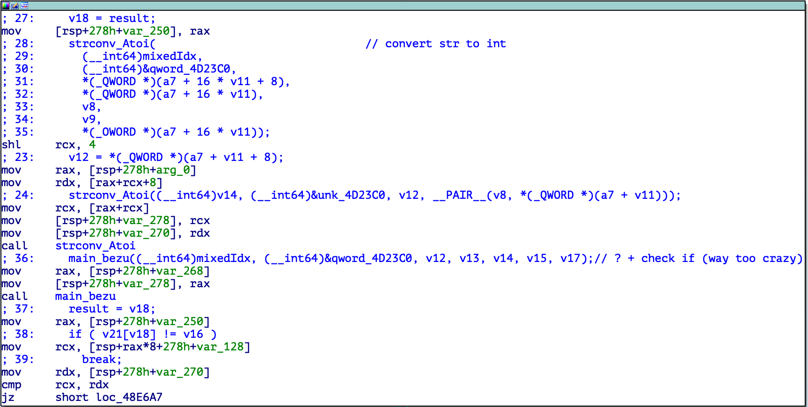
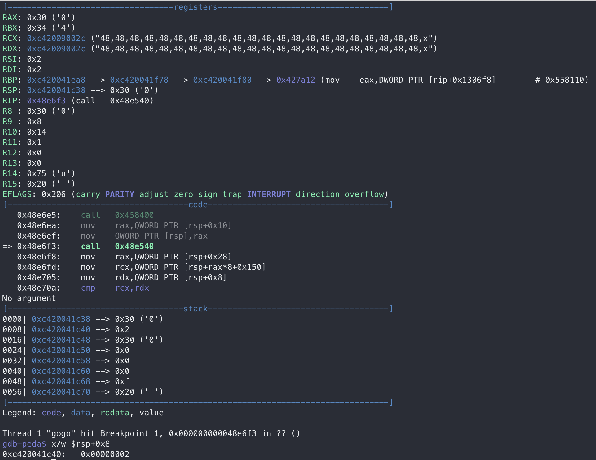
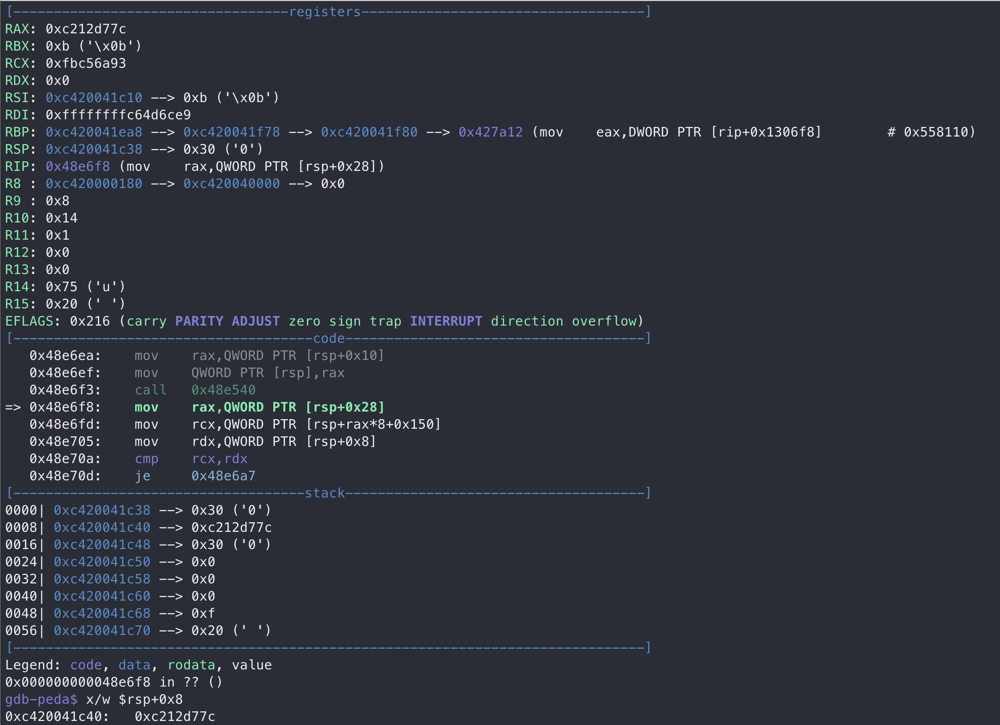

# HW0x07 writeup

## Going Crazy
> FLAG{gogo_p0werr4ng3r!you_did_IT!!!}

1. Use [IDAGolangHelper](https://github.com/sibears/IDAGolangHelper) to parse GoLang types information stored in compiled binary and rename each function.

2. Run the binary to get some information.
   ```
   $ ./gogo
   +================+
   |    Go Crazy    |
   +================+
   Say something :
   asdf
   no ! tOo NORmAL ! yoU hAvE To Be crAzY eNoUgh BeForE GEtTING flag
   ```
   Takes an input and response accordingly. If the input doesn't match, ask for another reply.
   
3. In `main_main`, use `fmt_Scanln` to get input and check it as below.
   ```go
         fmt_Scanln(a1, a2, (__int64)&v31, (__int64)v27, v10, v11);
         input_str = (_BYTE *)*v27;
         input_size = v27[1];
         if ( (signed __int64)input_size > 3 && *input_str == 'x' )
         {
         v16 = input_size - 1;
         if ( input_size - 1 > input_size )
            runtime_panicslice(a1, a2, v16);
         input_size_1 = v27[1];
         a2 = 1LL;
         if ( input_str[input_size - 1] == 'x' )
            break;
         }
   LABEL_3:
         *(_QWORD *)&v36 = &string_autogen_I4YD84;
         *((_QWORD *)&v36 + 1) = &failed_string;
         v27 = (_QWORD *)1;
         fmt_Println(a1, a2, (__int64)&v36, (__int64)&failed_string, v12, v13);
      }
   ```
   If the first and last element in the input are `x` ant the input length must be larger than `3`, terminate the loop, or else it'll print out `no ! tOo NORmAL ! yoU hAvE To Be crAzY eNoUgh BeForE GEtTING flag` and ask for another input.
   
4. Observe the next part in `main_main`.
   ```go
   *(_QWORD *)&v18 = input_size_1 - 2;
   *((_QWORD *)&v18 + 1) = &comma_string;
   strings_Split(
      a1,
      1LL,
      input_size_1 - 2,
      (__int64)input_str,
      v12,
      v13,
      (__int64)&input_str[((2 - input_size_1) >> 63) & 1],
      v18,
      1LL);
   main_check_input(a1, 1, v30, v28, v19, v20, v28, v29);
   if ( !v25 )
   {
      *(_QWORD *)&v37 = &string_autogen_I4YD84;
      *((_QWORD *)&v37 + 1) = &off_4D13B0;
      fmt_Println(a1, 1LL, (__int64)&v37, (__int64)&off_4D13B0, v23, v24);
      goto LABEL_3;
   }
   *(_QWORD *)&v38 = &string_autogen_I4YD84;
   *((_QWORD *)&v38 + 1) = &crazy_string;
   return fmt_Println(a1, 1LL, v21, v22, v23, v24);
   ```
   Use `,` to seperate the input into substrings in `strings_Split` and use `main_check_input` to check the input. Also, use variable, `v25`, to determine whether to print `ok` and go back to the loop which will then print out failing message and ask for input. Guess that final goal is to create an input that is able to let the binary print out `crazy_string`, `CRAZY!CRAZIER!CRAZIEST!!`.
   
5. Observe `main_check_input`
   ```go
   maybe_strcpy(v21, (__int128 *)&unk_4D22A0);
   maybe_strcpy(mixedIdx, (__int128 *)&qword_4D23C0);
   for ( result = 0LL; result < 36; result = v18 + 1 )
   {
      v11 = mixedIdx[result];
      if ( v11 >= size_after_split )
         runtime_panicindex(mixedIdx, &qword_4D23C0);
      v18 = result;
      strconv_Atoi(                               // convert str to int
         (__int64)mixedIdx,
         (__int64)&qword_4D23C0,
         *(_QWORD *)(a7 + 16 * v11 + 8),
         *(_QWORD *)(a7 + 16 * v11),
         v8,
         v9,
         *(_OWORD *)(a7 + 16 * v11));
      main_bezu((__int64)mixedIdx, (__int64)&qword_4D23C0, v12, v13, v14, v15, v17);
      result = v18;
      if ( v21[v18] != v16 )
         break;
   }
   return result;
   ```
   > dump both `unk_4D22A0, qword_4D23C0`
   
   In order to not trigger `runtime_panicindex`, `v11` has to be < `size_after_split` and since the first char in `mixedIdx` is `0xf`, `size_after_split` has to be at least `0x10`. That is, the input string should contain at least 15 `,` to seperate input into at least 16 substrings.  
   
   > Simpliest input that is able to pass this constraint is `x,,,,,,,,,,,,,,,x`
   
   However, instead of only able to pass the if statement when result is 0, it should be able to pass the statement for the whole loop. `v11` should at least be larger than the maximum element in `mixedIdx`, which is **35**. Therefore, input should be in such form, `x, [36 number seperated by ,], x`.
   
   - `mixedIdx`
     - observe the dumped data
     - contain 36 elements and every number from 0 to 35 but unsorted
     - From the code, find the `v11` is the variable that takes the value in `mixedIdx` in increasing order and is used to obtain the `v11`th element in input.
     - Therefore, guess that it contains **mixed index** that, instead of accessing elements in input from the first one, accesses the element in the order which `mixedIdx` specified.
   
   - `if ( v21[v18] != v16 )`
   
     - Looking into the **pseudo c code**, find that `v16` has never been assigned to any value.
   
     - deep into assembly
   
       
   
       - `cmp rcx, rdx` and `jz` in the end indicates that one of  `v21[v18], v16` is `rcx` and another one is `rdx`
       - `mov     rcx, [rsp+rax*8+278h+var_128]`
         - `rcx` depends on the value of `rax` and `rax` is the index in the loop
         - Therefore, `rcx` should be `v21[v18]` since `v18` actually has the same value as `rax`.
       - `mov     rdx, [rsp+278h+var_270]`
         - Then, `v16` should be `rdx`
   
6. What exactly is `v16`?

   - run binary in `gdb-peda`

   - Observe the value of `rsp+278h+var_270` before and after executing the function `main_bezu`

     > set a break point at `call    main_bezu` to take a better look at it 
     >
     > Use `x,48,48,48,48,48,48,48,48,48,48,48,48,48,48,48,48,48,48,48,48,48,48,48,48,48,48,48,48,48,48,48,48,48,48,48,48,x` as input

     |                            before                            |                            after                             |
     | :----------------------------------------------------------: | :----------------------------------------------------------: |
     |            |              |
     | `$rsp+0x8` is the number of character that is used to represent the **int** | `rsp+0x8` is the value that the `main_bezu` return when taking the **int** as argument |

7. Knowing that that the flag only contain printable characters, constuct a dictionary that map the return value of `main_bezu` to the input, which is `ord(printable char)` by using different **input** everytime and copy down the value of `rdx` after calling `main_bezu`.

8. (In [solve.py](./GoingCrazy/solve.py)) From the dumped data, `mixedIdx, qword_4D22A0`, and the constructed dictionary, the flag can easily be recovered.

   ```pseudocode
   From pseudo c code,
   	i-th element in qword_4D22A0 match the mixedIdx[i]-th int in the input
   	
   therefore,
   	get the mixedIdx[i]-th int in the input by using i-th element in qword_4D22A0 as key to find its corresponding value
   ```

   $\implies$ `FLAG{gogo_p0werr4ng3r!you_did_IT!!!}`
