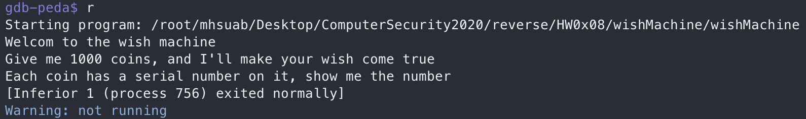
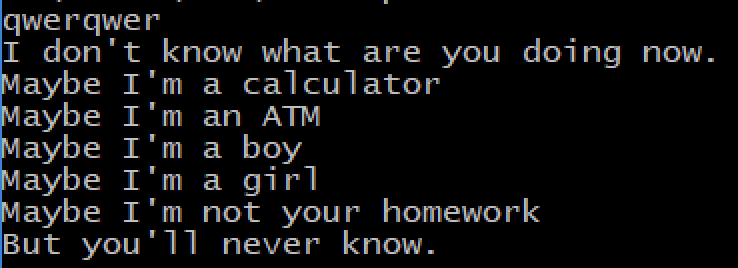
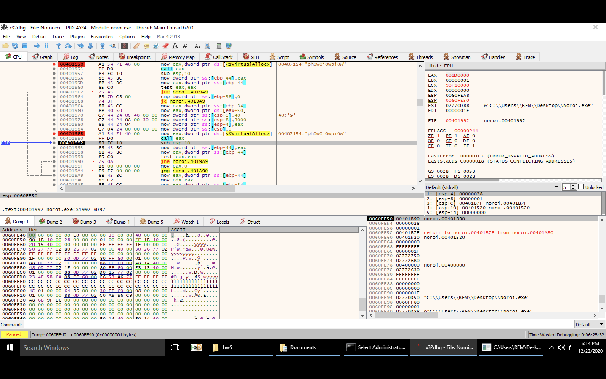
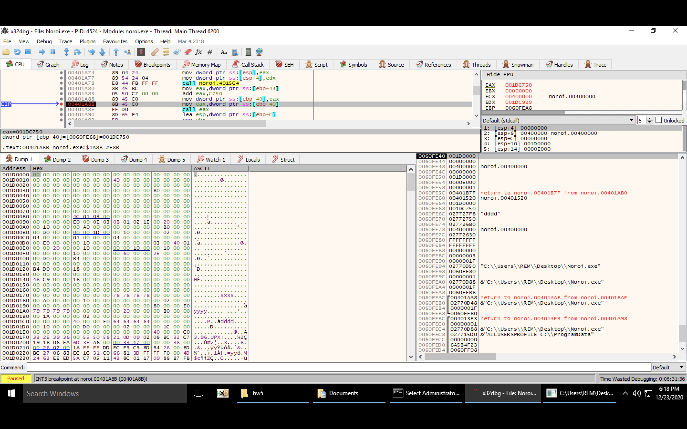
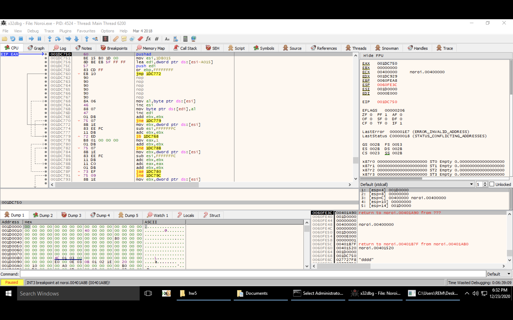
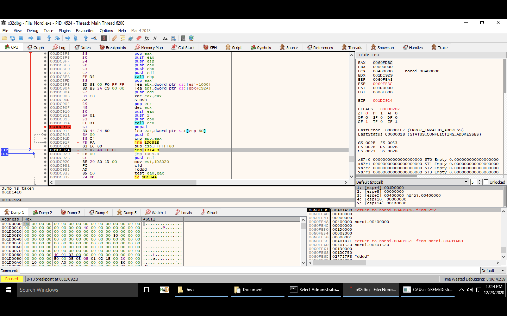
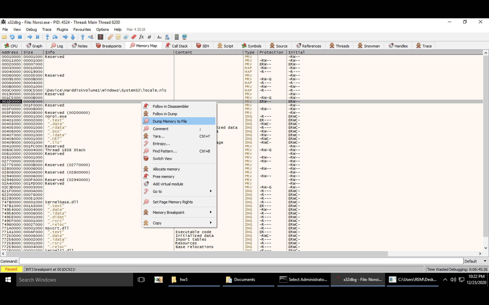
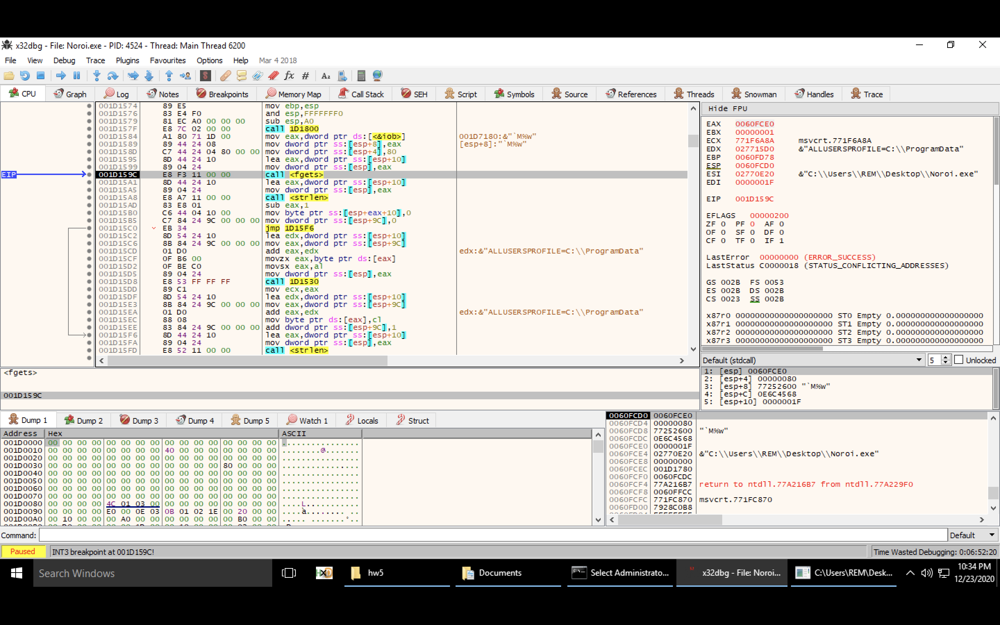
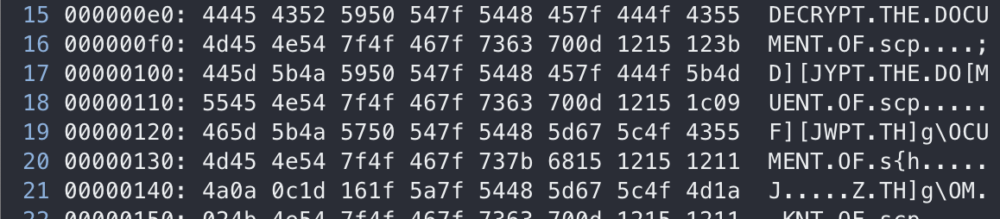
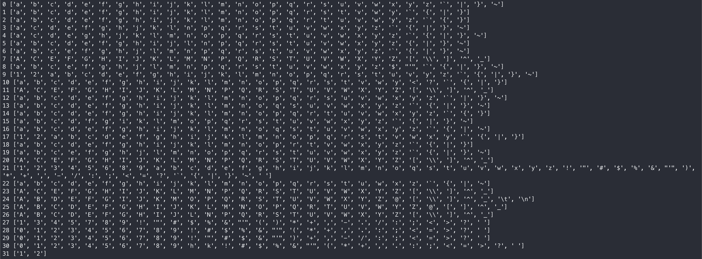

# HW0x08 writeup

## wishMachine
> FLAG{7hes3_func710n_ptrs_g1v3_m3_l0t_0o0of_f4n_I_w4n7_m00r3_11!!l1!|!}

1. execute the program and observe
   ```shell
   Welcom to the wish machine
   Give me 1000 coins, and I'll make your wish come true
   Each coin has a serial number on it, show me the number
   One by one, What is the serial number of coin0 ?
   ```
   Ask for input and exit when the input serial number not matched.
   
2. use **gdb peda** for dynamic analysis
   
   Program exit immediately.
   
   
   
3. ida pro to decompile program

   Find strings being displayed when using gdb-peda in *String Window* and **xref** to find the function that print these strings.

   ```c
     double v10; // xmm4_8
     double v11; // xmm5_8
     __int64 result; // rax
   
     sub_410BB0((signed __int64)"Welcom to the wish machine", a10);
     sub_410BB0((signed __int64)"Give me 1000 coins, and I'll make your wish come true", a10);
     sub_410BB0((signed __int64)"Each coin has a serial number on it, show me the number", a10);
     result = sys_ptrace(0, 0LL, 0LL, 0LL, a1, a2, a3, a4, v10, v11, a7, a8);
     if ( result == -1 )
       exit(0);
     return result;
   ```

   Find that the program call `ptrace` to detect whether the program being debugged. To bypass the detection, execute commands as follow after starting gdb

   ```shell
   gdb-peda$ catch syscall ptrace
   Catchpoint 1 (syscall 'ptrace' [101])
   gdb-peda$ commands
   Type commands for breakpoint(s) 1, one per line.
   End with a line saying just "end".
   >set ($eax) = 0
   >continue
   >end
   ```

4. main logic of the program

   - `main` function
     
      ```c
      ct = 0x55;
      ...
      v84 = 0x1F;
      for ( i = 0; i <= 999; ++i )
      {
         printf_("One by one, What is the serial number of coin%d ?", (unsigned int)i);
         malloc_((__int64)&input, 0LL, 70LL);
         scanf_("%70s", &input);
         check_input((__int64)&input);
         decrypt((__int64)&ct, (__int64)&input);
      }
      ```
      Assign value total of 70 characters to variables. Then, repeat the following steps for 1000 time, `printf` $\rightarrow$ `malloc` $\rightarrow$ `scanf` $\rightarrow$ `check_input` $\rightarrow$ `decrypt`.  
      Identify the assign value as `ct`, encrypted flag, which will be decrypted after entering 1000 correct serial number.
   - `decrypt`
      XOR 70 characters from `ct` and `input` and save the result to `ct`. Therefore, know that each should be at least **70** characters.

5. reverse `check_input`
   ```c
   __int64 __fastcall check_input(__int64 input_str)
   {
      __int64 result; // rax
      signed int i; // [rsp+1Ch] [rbp-4h]
   
      for ( i = 0; i <= 69; i += dword_8A2118 )
      {
         qword_8A2108 = input_str;
         dword_8A2114 = *((_DWORD *)&unk_6D5114 + 10 * dword_8A1070);
         dword_8A2118 = *((_DWORD *)&unk_6D5118 + 10 * dword_8A1070);
         dword_8A211C = *((_DWORD *)&unk_6D511C + 10 * dword_8A1070);
         dword_8A2120 = dword_6D5120[10 * dword_8A1070];
         dword_8A2110 = *((_DWORD *)&unk_6D5110 + 10 * dword_8A1070);
         qword_8A2100 = *((_QWORD *)&unk_6D5100 + 5 * dword_8A1070) + dword_8A2110;
         ((void (*)(void))qword_8A2100)();
         ++dword_8A1070;
         result = (unsigned int)dword_8A2118;
      }
      return result;
   }
   ```
   In this function, it use data stored in memory, starting from 0x6D5100, to assign value to each variable.  

   Also, while using **dynamic analysis** to trace, find serveral information. Listed as follow,

   - Initial value of `dword_8A1070` is *0*
   - Instead of multiply by *10* or *5*, `dword_8A1070` actually multiplied by **40**

   $\therefore$  implement python code to calculate each value

6. implement code to replicate `check_input` to find the correct input

   Since it use data that are stored in memory, read data directly from binary.

   1. calculate offset
      - knowing that at 0x6D5100 is actually at 0xd5100 in the binary $\rightarrow$ set `OFFSET = 0x600000`
      - whenever needed to get any data, takes the address display in ida pro minus `OFFSET` to get its position in file
   2. `*((_DWORD *)&unk_6D511C + 10 * dword_8A1070)` is actually reading *4* bytes from `0x6D511C + 40 * dword_8A1070` in this case

   $\therefore$ Use the data read from binary the value of `dword_8A2114, dword_8A2118, dword_8A211C, dword_8A2120, dword_8A2110, qword_8A2100` can easily be calculated.

   Knowing that at the end of each loop, call function using the calculated value, `qword_8A2100`. Calculate all 1000 result of `qword_8A2100` and find only 5 functions, `0x40102d, 0x4011d6, 0x401138, 0x4010c8, 0x400fbe`, have been called.

   All 5 functions came in similar structure, 

   ```python
   for i in range(dword_8A2118):
     a = calculate value according to the (dword_8A2114 + i)th character in input_str
     if i == 0:
   		b = data that dword_8A211C point to 
     elif i == 1:
       b = data that dword_8A2120 point to
     if (a != b):
       exit()
   ```

   Therefore, implement each function seperately and construct dictionary for all 5 functions using the result as key and the input as value. The input should only be uppercase character or digits. That is, as the matched data and the function being found, use the corresponding dictionary to get the value, which should be the correct input, of the key, matched data.  

   $\implies$ for every serial number, repeat the described step until every character in the input string has been checked.

7. Use the **implemented `check_input`** to find the correct input, **XOR** the input and `ct`, and save the **XOR** result to `ct`. Repeat the step for 1000 times, the result of the **XOR** is the flag, `FLAG{7hes3_func710n_ptrs_g1v3_m3_l0t_0o0of_f4n_I_w4n7_m00r3_11!!l1!|!}`.


## Curse
> FLAG{yes_this_is_your_homework_with_upx_and_no_pe_header_and_this_is_the_flag}

1. execute the binary and observe its behavior

   

   Ask an input, somehow test the input, and response.

2. **dynamic analyze** the program (**x32dbg**)

   1. `VirtualAlloc` $\rightarrow$ alloc memory of size `0xE000` and the base address is at `the return value of VirtualAlloc, current EAX`

      

   2. follow the address in **Dump**

      

      Find that the program **write data** to the alloced memory and the written data seem to be like a *UPX packed PE file*. Then, the program will call function at `base address of written data + 0xC750`, which is a function just being written.

   3. UPX

      |            pushad            |            popad            |
      | :--------------------------: | :-------------------------: |
      |  |  |

      Include features of a upx-packed executable, `pushad, popad, then jump to its real EntryPoint`. Real `EntryPoint = base address + 0x14E0`.

3. dump the writen section

   - Find the allocated memory section at the **Memory Map** tab and dump the section.

     

4. use ida pro to **static analysis** the dumped file

   - find the important function

     - since the binary will ask an input, guess that the crucial function will be called after it.

     - find the address of the function the asked for input

       

   - Start analysis function that call `fgets`

     ```c
      (base address = 0x100000)
      unsigned int v0; // eax
      int v1; // eax
      char input_str[140]; // [esp+10h] [ebp-90h]
    unsigned int i; // [esp+9Ch] [ebp-4h]
     
      sub_101800();
      fget_(input_str, 128, *(_DWORD *)((char *)&loc_10717E + 2));
      input_str[strlen_(input_str) - 1] = 0;
      for ( i = 0; ; ++i )
      {
        v0 = strlen_(input_str);
        if ( v0 <= i )
           break;
        input_str[i] = modified_input(input_str[i]);
      }
      v1 = strlen_(1061664);
      if ( strncmp_(0x103320, input_str, v1) )
      {
        puts_(0x104000);                            // aIDonTKnowWhatA
        puts_(0x104025);
        puts_(0x10403C);
        puts_(0x10404D);
        puts_(0x10405D);
        puts_(0x10406E);
        puts_(0x10408A);
      }
      return 0;
     ```
     
     - `for loop` $\rightarrow$ call `modified_input` on each input character
     - use `strncmp` to compare the data at `base address + 0x3320`
       - compare `0x4E` characters, identified in **x32dbg**
     
   - `modified_input`

     ```c
     int __cdecl modified_input(int single_input_char)
     {
       int result; // eax
       signed int i; // [esp+10h] [ebp-4h]
     
       result = single_input_char;
       for ( i = 0; i <= 758; i += 2 )
       {
         result = *(unsigned __int8 *)(i + 0x103020);
         if ( (_BYTE)single_input_char == (_BYTE)result )
           return *(unsigned __int8 *)(i + 0x103021);
       }
       return result;
     }
     ```
   
     Search through data at `base address + 0x3020 + 2 * i`, where $0\leq i\leq 379$. If the data matches the input character when `i = n`, change the corresponding input character to the data at `base address + 0x3021 + 2 * n`.

5. implement code to get flag

   - dump data `0x4E` bytes starting from `base address + 0x3320`, result of input after modified, and ` 760` bytes starting from `base address + 0x3020`, data used to modified input
     - **result** = result of input after modified
     - **data** = data used to modified input
   - Iterate through all characters in **result** to find the ***odd index, i,*** whose corresponding element in **data** matches the character. Then, the character of flag at that position should be **data[i - 1]**

## SecureContainProtect

> FLAG{oh_my_g0d_hoo0ow_did_you_decrypt_this???}

1. execute the program and observe its behavior

   Give a sudoku challenge $\rightarrow$ use [sudoku online solver](https://www.sudokuwiki.org/sudoku.htm) to get the solution

2. static analysis

   - `main`

     while loop to take input for solving the challenge and after pressing **z** indicating *finish*, call `check_finish` to check the sudoku answer

   - `check_finish`

     1. use data in memory to check whether the ans of the sudoku correct
     2. ask for `ACTION NOTE` to determine whether or not to print out the flag

3. restore `ACTION NOTE`

   - `ACTION NOTE` should be printable characters and less than *39*
   - the flag is **ascii art** $\rightarrow$ all **ascii characters**, some repeated characters

   - $flag = byte{\_}202E00\ xor\ cycle(ans{\_}sudo)\ xor\ cycle(ACTION\ NOTE)$

     - therefore, calculate $CT = byte{\_}202E00\ xor\ cycle(ans{\_}sudo)$ first and find that it has a pattern that reapeat every 32 bytes

       

   $\therefore$ guess that the input should have the length of 32

   

   1. split $CT$ into groups of 32 bytes and $\forall x, 0\leq x\lt 32,$ XOR the *x-th* character in each  group with a printable character, $c$

      $\therefore$ if all characters after XOR belong to printable charcaters, save $c$ as a possible answer for the *x-th* character of `ACTION NOTE​`

      

      However, except of the *31-th* character, all other position seem to have too many posibility which makes it impossible to guess

   2. since the flag is **ascii art**, it should contain lots of repeated characters. Also, `CT` has a repeated pattern of `b'DECRYPT\x7fTHE\x7fDOCUMENT\x7fOF\x7fscp\r\x12\x15\x12\x11'`

      $\therefore$ XOR the pattern with all printable characters. Then, find the one that looks like it can be `ACTION NOTE`

   3. `ACTION NOTE = decrypt_the_document_of_SCP-2521` and then get the flag, `FLAG{oh_my_g0d_hoo0ow_did_you_decrypt_this???}`

